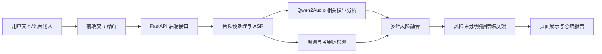

# 2026 年度项目结题总结材料（草稿）

> 说明：本材料依据当前仓库中已经实现并可验证的系统能力整理而成，可作为“大创 / 金种子”项目结题电子版总结材料底稿使用。提交前请补充项目正式名称、项目编号、团队成员、指导教师、阶段性成果截图及如有的论文、专利、竞赛获奖信息。

## 一、项目基本信息

| 项目项 | 建议填写内容 |
| --- | --- |
| 项目名称 | 请按立项书正式名称填写，建议可对应为“电信诈骗风险阻断系统”或正式申报名称 |
| 项目类型 | 大创项目 / 金种子项目 |
| 项目周期 | 请按立项书填写 |
| 项目负责人 | 待补充 |
| 团队成员 | 待补充 |
| 指导教师 | 待补充 |

## 二、项目摘要

本项目面向电信诈骗识别、防范和宣传教育场景，围绕“事前训练、事中预警、事后分析”三类需求，设计并实现了一个集 AI 陪练、实时监护、案例分析于一体的电信诈骗风险阻断系统。项目以多模态音频与文本处理为基础，结合语音识别、音频预处理、风险特征提取和大模型分析能力，构建了较完整的反诈应用链路。

在系统设计上，项目采用前后端分离架构。前端面向用户提供场景化训练、风险可视化和分析结果展示；后端基于 FastAPI 构建业务服务，通过 WebSocket 支撑实时音频流处理，并整合 ASR、Qwen2Audio 相关模型能力、TTS 反馈能力和规则融合策略，形成可运行、可展示、可扩展的项目原型。

当前项目已经完成核心功能闭环，实现了诈骗场景 AI 对话模拟、实时音频风险监护、离线文件案例分析、会话总结评分、远程一键启动与对外访问支持等能力，具备较好的结题展示基础与后续深化空间。

## 三、项目背景与研究意义

电信诈骗具有话术更新快、诱导链路长、情境欺骗强等特点，传统依赖人工经验或单一文本规则的方法，难以兼顾实时性、准确性与用户教育效果。本项目聚焦以下几个现实问题：

1. 用户缺乏低成本、可重复、可互动的反诈训练环境。
2. 实时通话或音频场景中的诈骗风险难以及时发现并提示。
3. 诈骗案例分析通常停留在事后人工总结，缺少结构化辅助工具。

因此，本项目尝试将多模态模型与工程系统结合，既做“识别”，也做“训练”，再延伸到“分析”，提升反诈系统的完整性与实用价值。

## 四、项目目标

本项目的核心目标包括：

1. 构建一个面向电信诈骗场景的多模态风险阻断系统原型。
2. 实现 AI 陪练模块，使用户能够在模拟诈骗场景中进行交互式训练。
3. 实现实时监护模块，对连续音频流进行风险识别与预警。
4. 实现案例分析模块，对上传文件进行离线分析与结果展示。
5. 形成可部署、可演示、可扩展的完整项目工程，支撑结题展示与后续迭代。

## 五、项目主要研究内容

### 1. AI 陪练模块

该模块用于模拟常见诈骗通话情境，通过文本或语音方式与用户开展交互训练。系统会在对话过程中扮演诈骗方角色，动态生成诱导话术，并根据用户回应识别其防诈动作，输出陪练总结报告。

当前已覆盖 4 类典型陪练诈骗场景：

- 身份冒充诈骗
- 投资理财诈骗
- 中奖诈骗
- 紧急施压诈骗

### 2. 实时监护模块

该模块通过 WebSocket 接收音频流，对通话内容进行持续分析，结合语音识别结果、关键词规则、模型分析结果与声学特征，输出风险评分、风险等级及预警信息，适用于实时监测与风险提示场景。

### 3. 案例分析模块

该模块支持上传音频或文本类文件，系统对材料进行异步分析，并向用户展示分析进度、风险结果与相关判断信息，适用于案例回放、项目展示和分析研判场景。

### 4. 工程部署与演示支撑

除核心业务模块外，项目还完成了适配远程 Linux/AutoDL 环境的启动脚本、日志体系、健康检查和 Cloudflare Quick Tunnel 外网访问能力，便于在答辩和演示环境中快速启动与稳定展示。

## 六、研究方法与技术路线

本项目采用“前端交互层 + 后端业务层 + 音频处理层 + 模型推理层”的技术路线，将传统 Web 系统开发与 AI 音频理解能力结合起来。

具体研究方法包括：

1. 前后端分离开发方法：前端使用 Vue 3 + Vite 构建交互页面，后端使用 FastAPI 提供 API 和 WebSocket 服务。
2. 语音识别方法：将语音输入转写为文本，降低音频理解难度，为后续风险分析提供文本依据。
3. 多模态分析方法：结合音频信息、转写文本和模型语义理解能力，对诈骗风险进行综合判断。
4. 规则融合方法：在模型分析之外，引入诈骗关键词、话术特征、用户防御行为识别等规则，提高系统可解释性。
5. 工程验证方法：通过健康检查、日志记录和烟雾测试，验证核心链路可用性。

## 七、项目实施过程

### 第一阶段：需求梳理与系统方案设计

围绕“训练、监护、分析”三条主线明确系统范围，确定项目采取前后端分离架构，建立 AI 陪练、实时监护和案例分析三大模块。

### 第二阶段：前后端基础框架搭建

前端完成首页、陪练页、监护页、分析页、设置页等主要功能页面搭建；后端完成主应用入口、业务路由、数据库初始化、会话管理、日志机制等基础框架。

### 第三阶段：音频与模型链路打通

实现音频预处理、语音识别、Qwen2Audio 相关模型接入、TTS 输出、风险评分与关键词检测等能力，建立从音频输入到结果反馈的完整链路。

### 第四阶段：业务功能联调与演示能力增强

完成一键启动脚本、后台保活、远程访问支持、日志输出、健康检查及分析/监护烟雾测试，提升系统在远程服务器与答辩演示环境中的可运行性。

### 第五阶段：陪练评估逻辑优化

项目对 AI 陪练总结逻辑进行了专项优化，不再仅依赖单一关键词判断，而是从“怀疑诈骗、主动核实、拒绝操作、报警举报、终止通话、保护隐私”六类防御信号重新计算识别表现，使总结结果更加贴近真实反诈行为。

## 八、关键数据与量化结果

结合当前系统实现情况，可形成以下可验证的量化结果：

| 指标 | 当前结果 |
| --- | --- |
| 核心业务链路 | 3 条：AI 陪练、实时监护、案例分析 |
| 前端主要功能页面 | 5 个：首页、陪练、监护、分析、设置 |
| AI 陪练诈骗场景 | 4 类 |
| 后端核心业务路由 | 4 类：陪练、监护、分析、配置 |
| 后端核心服务模块 | 6 类：AI 对话、风险检测、ASR、TTS、音频处理、监护会话管理 |
| 陪练防御信号识别类别 | 6 类：怀疑、核实、拒绝、举报、终止、信息保护 |
| 实时监护规则特征类别 | 6 类：紧迫施压、权威冒充、资金诱导、威胁恐吓、利益诱饵、身份冒充 |
| 已打通烟雾测试链路 | 2 条：案例分析链路、实时监护链路 |

此外，项目在模型方向上参考了电信诈骗检测领域公开研究成果 TeleAntiFraud-28k，该研究公开了 28,511 组语音文本样本，为本项目理解电信诈骗多模态建模路径提供了重要参考。该部分属于项目采用的技术参考基础，不计作本项目自有论文成果。

## 九、项目主要成果

### 1. 软件系统成果

项目已经形成一个可运行的软件系统原型，具备以下特点：

- 支持文本和语音两种输入形式
- 支持 AI 陪练、实时监护、案例分析三类业务场景
- 支持本地访问与远程公网演示
- 支持后台运行、日志追踪和健康检查
- 支持较完整的工程化部署流程

### 2. 模块化工程成果

项目已形成较清晰的前后端模块划分与服务组织方式，具备继续扩展模型、增加策略和接入更多业务场景的基础。

### 3. 训练与评估机制成果

在 AI 陪练部分，项目已形成一套面向反诈训练的会话总结与表现评分逻辑，可对用户在模拟诈骗对话中的防御行为进行识别和反馈。

### 4. 演示与答辩支撑成果

项目已整理启动说明、部署说明、模型接入说明、技术总结文档等材料，具备较好的结题答辩展示条件。

### 5. 其他成果补充栏

以下成果如团队已有，请在正式提交版中补充：

- 论文发表情况：待补充
- 专利或软著申请情况：待补充
- 竞赛获奖情况：待补充
- 校级/院级展示情况：待补充

## 十、项目创新点

结合当前项目完成情况，本项目的创新点主要体现在以下几个方面：

1. 将“反诈训练”“实时预警”“案例分析”三类能力整合到同一系统中，不再局限于单一检测功能。
2. 将大模型音频理解能力与传统规则特征结合，提高系统的可解释性与应用完整度。
3. AI 陪练不只是静态问答，而是模拟诈骗场景中的动态交互，并对用户防诈行为进行结构化评分。
4. 项目兼顾算法实现与工程落地，支持远程服务器场景下的一键启动、日志追踪和公网演示，提升了项目展示可行性。

## 十一、项目不足与后续展望

虽然项目已经完成核心原型，但仍有进一步提升空间：

1. 当前系统仍以原型验证和功能闭环为主，后续可补充更系统的实验指标与用户测试数据。
2. 在模型层面，后续可进一步提升特定诈骗场景下的识别准确率与鲁棒性。
3. 可继续扩展陪练场景种类，增加更复杂的话术变体和用户画像适配能力。
4. 可引入更完善的数据可视化仪表盘，增强项目展示效果和结果解释能力。
5. 可进一步推进论文、软著、专利或竞赛成果转化，完善项目结题成果矩阵。

## 十二、结题展示建议

为便于后续交由广告公司制作成果展板，建议从以下几个方面准备图表和图片：

### 1. 建议准备的截图材料

- 系统首页截图
- AI 陪练对话界面截图
- AI 陪练总结报告截图
- 实时监护风险提示界面截图
- 案例分析上传与结果页面截图
- 系统部署运行截图或后台日志运行截图

### 2. 建议制作的图表

- 系统总体架构图
- 三大业务模块流程图
- AI 陪练评分机制示意图
- 实时监护风险分析流程图
- 项目阶段实施时间线
- 项目成果统计图

### 3. 建议展板中的重点突出内容

- 项目聚焦真实电信诈骗防护场景
- 支持语音与文本双通道输入
- 包含训练、监护、分析三类核心能力
- 具备可运行的软件系统原型
- 具备后续扩展为竞赛、软著、论文成果的基础

## 十三、展板文案简版

以下内容可直接作为成果展板或宣传页的基础文案：

### 展板标题建议

电信诈骗风险阻断系统

### 展板副标题建议

基于多模态音频理解与智能交互的反诈训练、监护与分析一体化平台

### 展板简介

本项目面向电信诈骗识别与防范需求，构建了一个集 AI 陪练、实时监护、案例分析于一体的智能反诈系统。项目基于前后端分离架构，融合语音识别、音频处理、大模型分析与规则特征提取能力，实现了从诈骗场景模拟训练到实时风险预警、再到离线案例分析的完整闭环。系统目前已完成核心原型开发，具备较强的展示性、实践性与后续扩展价值。

### 展板亮点关键词

- 多模态反诈
- AI 陪练
- 实时监护
- 风险预警
- 案例分析
- 语音识别
- 大模型应用
- 工程化部署

## 十四、提交前建议补充项

正式提交前，建议团队补充以下信息，以增强材料完整度：

1. 项目正式名称、编号、负责人、团队成员、指导教师。
2. 项目研发时间线或阶段成果记录。
3. 系统界面截图、运行截图、演示照片。
4. 若已有论文、专利、软著、竞赛获奖，请补充为单独一节。
5. 若学院线下答辩需展示实物或演示视频，可同步准备二维码或视频链接。

## 十五、可直接用于提交邮件的附件命名建议

建议统一使用以下命名方式：

- `项目名称-结题总结材料.pdf`
- `项目名称-系统界面截图.zip`
- `项目名称-演示视频.mp4`
- `项目名称-补充成果附件.zip`

如果后续需要，我还可以继续将这份材料压缩成：

- 一页式展板文案版
- PPT 汇报版
- 结题答辩讲稿版